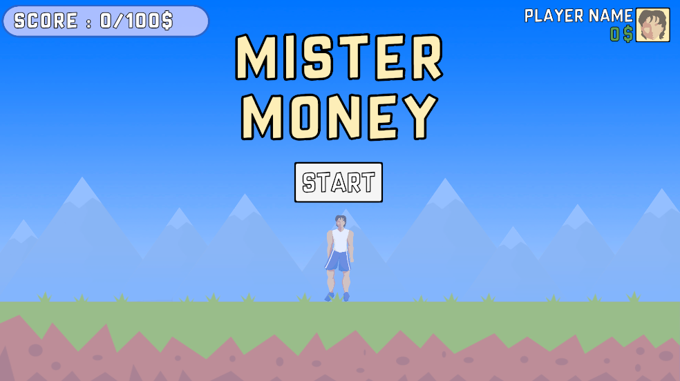

# Mister Money

## Introduction 🤔
__Mister Money__ is 

> Do you want to know why i named my project `Mister Money`?🤷🏽‍♂️ Well....

> A team of enthusiasts who came together to create a unique experience: “Mister Money”. The idea was simple but captivating - a 2D game where players would take on the role of Mister Money, an intrepid character in search of infinite wealth.

  

## Live Site 🕸️
__Website Link__: [VISIT](https://abdesslammekouar4.wixsite.com/mister-money)

__You like it right ?!__ 😆 now connect with me on **[Linkedin](https://www.linkedin.com/in/amekouar/)** or **[Mail](mailto:a.mekouar@outlook.com)**

## Technologies Used 💻

The development of "Mister Money" was a seamless fusion of cutting-edge technology and meticulous architecture, driven by the powerful combination of C# programming language and Unity Hub.

C# served as the backbone of the project, providing a robust and versatile programming language for game development. Its object-oriented approach allowed for efficient code organization, fostering maintainability and scalability. Unity Hub, the integrated development environment, was the chosen platform for its comprehensive suite of tools tailored for game design.

## Getting Started 💁🏽
### Windows
Clone Folder : Mister-Money_Exec

launch Mister_Money_game.exe

### Android
Download Mister_Money_game.apk

In order to install apk file to the Android device, basically we need to do the following. 1. On Android device, navigate to 'Apps' > 'Settings' > 'Security', enable 'Unknown Sources', then tap 'OK' to agree to enable this setting. This will allow the installation of third party apps and standalone APKs.

## Contributing 🧑🏽‍💼

I welcome contributions to Mister Money! Please see my [contribution file](CONTRIBUTING.md) for more information on how to get started.

## Acknowledgement🫂

I would like to express my sincere gratitude to the mentors at the **[ALX Software Engineering Program](https://www.alxafrica.com/software-engineering/)** for their guidance and support throughout the program and development of this project. Their expertise and insights have been invaluable in helping me overcome challenges and achieve my goals.

I would also like to thank my fellow students in cohort 13 for their camaraderie and collaboration. Their feedback and encouragement have been instrumental in helping me grow and improve as a developer.

In addition, I would like to thank the online community for their willingness to answer my questions and provide guidance when I needed it. Their knowledge and expertise have been a valuable resource in helping me overcome obstacles and make progress on my project.
